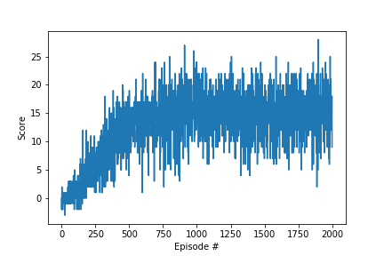

# DRL_Udacity_Bananas

This project implements Banana Collector Agent in Udacity provided enviorenment that is similar to Unity-ML Environment. The purpose of the agent is to collect as many yellow bananas as possible while avoiding blue bananas. A reward of +1 is provided for collecting a yellow banana, and a reward of -1 is provided for collecting a blue banana. The task is episodic, and in order to solve the environment, agent must get an average score of +13 over 100 consecutive episodes.

The state space of the environment has 37 dimensions and contains the agent's velocity, along with ray-based perception of objects around the agent's forward direction. Given this information, the agent has to learn how to best select actions. Four discrete actions are available, corresponding to:

- **`0`** - move forward.
- **`1`** - move backward.
- **`2`** - turn left.
- **`3`** - turn right.

The agent implements DQN which uses fully connected network (FCN) to estimate the state-action values. First DQN is called online DQN and it is updated after every experience tuple. Second DQN is called target DQN and updated after every 4 experience tuple/learning step by copying from parameters of online DQN.  Both target and online DQN is essentially a FCN with 2 hidden layers each with 64 nodes. RelU is used for activation function. Output node activations are also directly comes from RelU in contrast to usual practice of softmax function. 

Following files exist in the project;

- Navigation.ipynb    : Pyhton Jupyter notebook that runs the main training loop.
- dqn_agent.py        : Implementation of the agent that interacts with environment. It implements DQN learning which instantiates two FCN networks.
- fc_model.py         : Implementation of the FCN. 
- README.md           : This file.
- checkpoint_last.pth : Saved model parameters.
- Banana.app          : Udacity provided Banana aplication environment.



### Getting Started

1. Download the environment from one of the links below.  You need only select the environment that matches your operating system:
    - Linux: [click here](https://s3-us-west-1.amazonaws.com/udacity-drlnd/P1/Banana/Banana_Linux.zip)
    - Mac OSX: [click here](https://s3-us-west-1.amazonaws.com/udacity-drlnd/P1/Banana/Banana.app.zip)
    - Windows (32-bit): [click here](https://s3-us-west-1.amazonaws.com/udacity-drlnd/P1/Banana/Banana_Windows_x86.zip)
    - Windows (64-bit): [click here](https://s3-us-west-1.amazonaws.com/udacity-drlnd/P1/Banana/Banana_Windows_x86_64.zip)
    
    (_For Windows users_) Check out [this link](https://support.microsoft.com/en-us/help/827218/how-to-determine-whether-a-computer-is-running-a-32-bit-version-or-64) if you need help with determining if your computer is running a 32-bit version or 64-bit version of the Windows operating system.

    (_For AWS_) If you'd like to train the agent on AWS (and have not [enabled a virtual screen](https://github.com/Unity-Technologies/ml-agents/blob/master/docs/TrGaining-on-Amazon-Web-Service.md)), then please use [this link](https://s3-us-west-1.amazonaws.com/udacity-drlnd/P1/Banana/Banana_Linux_NoVis.zip) to obtain the environment.

2. Clone the repisotory at https://github.com/dhesin/DRL_Bananas

3. From the command line terminal run ```jupyter Navigation.ipynb ```
