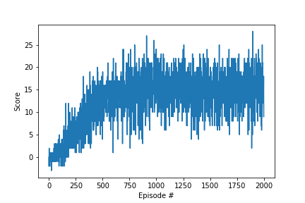

## Deep_Reinforcement_Learning_Udacity_Banana_Collector


This project implements Banana Collector Agent in Udacity provided environment that is similar to Unity-ML Environment. The purpose of the agent is to collect as many yellow bananas as possible while avoiding blue bananas. A reward of +1 is provided for collecting a yellow banana, and a reward of -1 is provided for collecting a blue banana. The task is episodic, and in order to solve the environment, agent must get an average score of +13 over 100 consecutive episodes.

The state space of the environment has 37 dimensions and contains the agent's velocity, along with ray-based perception of objects around the agent's forward direction. Given this information, the agent has to learn how to best select actions. Four discrete actions are available, corresponding to:

- **`0`** - move forward.
- **`1`** - move backward.
- **`2`** - turn left.
- **`3`** - turn right.

The agent implements DQN learning algorithm which uses fully connected network (FCN) to estimate the state-action values. First DQN is called online DQN and it is updated after every experience tuple. Second DQN is called target DQN and updated after every 4 experience tuple/learning step by copying from parameters of online DQN.  

DQN learning algorithm uses epsilon-greedy action selection with decaying epsilon from 1.00 to 0.01 with decay factor of 0.995. Other DQN hyper-parameters such as reward discount factor, soft update of target DQN state-action values are set as 0.99 and 0.001 respectively.

Both target and online DQN is essentially a FCN with 2 hidden layers each with 64 nodes. RelU is used for activation function. Output node activations are also directly comes from RelU in contrast to usual practice of softmax function. Learning rate for FCN network is set as 5e-4.

During training loop in Navigation.ipynb, average score of 15 is set as the solution and the agent was able to solve the environment in 636 episodes as seen below.
```
Network(
  (hidden_layers): ModuleList(
    (0): Linear(in_features=37, out_features=64, bias=True)
    (1): Linear(in_features=64, out_features=64, bias=True)
  )
  (output): Linear(in_features=64, out_features=4, bias=True)
  (dropout): Dropout(p=0.0)
)
Episode 100	Average Score: 0.61
Episode 200	Average Score: 3.02
Episode 300	Average Score: 6.51
Episode 400	Average Score: 9.00
Episode 500	Average Score: 12.33
Episode 600	Average Score: 13.36
Episode 700	Average Score: 14.27
Episode 736	Average Score: 15.02
Environment solved in 636 episodes!	Average Score: 15.02
```

Run Until Solution         |Run 2000 episodes
:-------------------------:|:-------------------------:
  |  


After solving environment, model parameters are saved, agent is re-instantiated by loading model parameters and run through one episode with a reward of +14.
```
Network(
  (hidden_layers): ModuleList(
    (0): Linear(in_features=37, out_features=64, bias=True)
    (1): Linear(in_features=64, out_features=64, bias=True)
  )
  (output): Linear(in_features=64, out_features=4, bias=True)
  (dropout): Dropout(p=0.0)
)
Score: 14.0
```

It is observed that agent was able to collect a reward of +13 most of the time but there were cases where agent got stuck and make back and forth moves in cases such as it is close to blue banana or it is located in same close distance to both yellow and blue bananas. It will be interesting to see how this problem will improve through the implementation of Double DQN and prioritized experience replay as well as learning from visual information.

Stay Tuned ! This project will be improved with Double DQN and prioritized experience replay as well as learning from visual data of agent instead of obstacle ray data.


